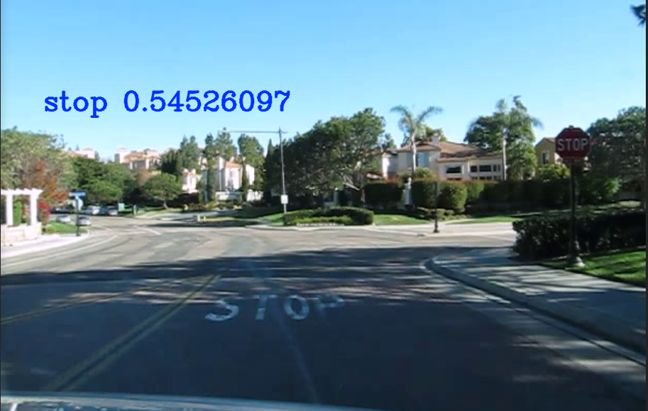
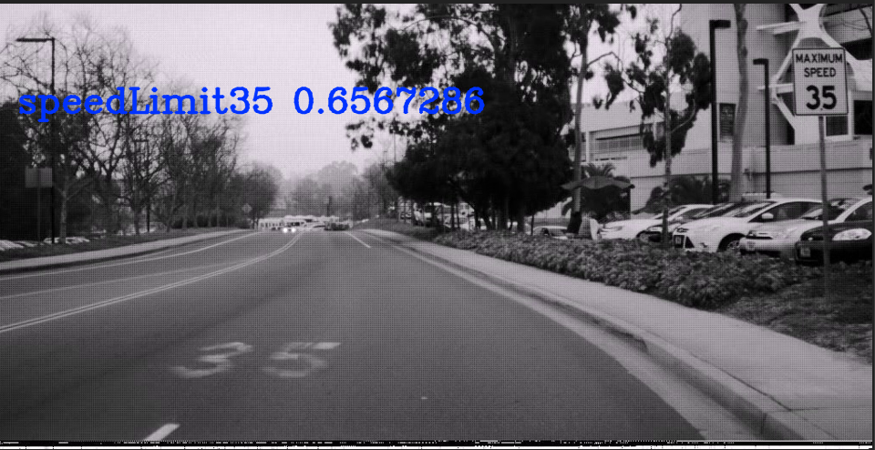
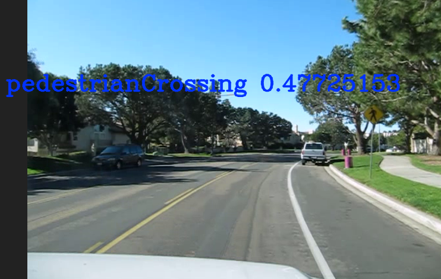
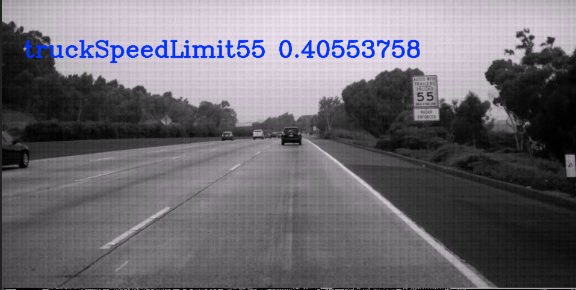

# AlphaSign: Traffic Sign Classification

## Overview
The purpous of this project is to be able to predict the meaning of a traffic sign in an image. At the moment we only have classification functioning but we are planning on doing object detection in the end.

Example Classifications below

## Dataset
The dataset we used for this project is the LISA Traffic Sign Dataset. It contains 47 distinct traffic sign classes. (https://www.kaggle.com/mbornoe/lisa-traffic-light-dataset)

## CNN's
Our plan is to create multiple CNN's and choose the one that works best. 

## AlexNet
### Preprocessing
Memory ended up being a big issue for this one. Not only was the training data maxing out my 16gb of RAM but the network maxed out all 16gb of my GPU's ram. To deal with this we had to sample the Dataset right off the bat. We also resized our images to each be 227 x 227. The goal here was just a pure AlexNet implementation so it only made sense to use the same size as they did. We also normalized each of the images and encoded the target variables before we started training.
### Training
Basically every layer here is the same as it is in AlexNet. Only thing we needed to change was batch size since my GPU couldn't handel 128.
### Preformance
We achieved 87% accuracy on our testing data. I was fully convinced that the model couldn't go higher than 85% after trying out different models for hours so that 2% improvement is what you like to see.