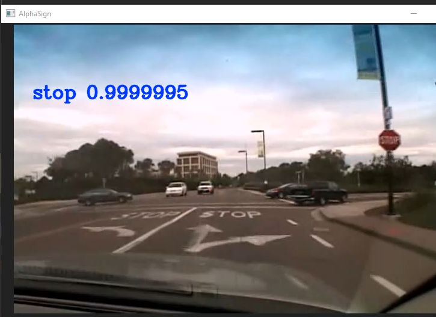

# AlphaSign: Traffic Sign Classification

## Overview
The purpous of this project is to be able to predict the meaning of a traffic sign in an image. We where able to achieve this through image classification and have a testing accuracy of 96.71%

Example Classifications below

## Dataset
The dataset we used for this project is the LISA Traffic Sign Dataset. It contains 47 distinct traffic sign classes. (https://www.kaggle.com/mbornoe/lisa-traffic-light-dataset)

## Models's
We created implementations for AlexNet, VGG16, and Inception ResNet V2 and compaired the accuracy between each to see which is best for traffic sign classification. Our repo is a little all over the place but if you want to see the models go to lib/models.py their nice and organized in there.

## Preprocessing
The LISA traffic sign dataset contains images where there are multiple signs. This is good if you want to do something line object detection but we are doing image classification. So we just removed each of these. We also had to resize the images in our training data for each of the models. For AlexNet we had to used and input size of 227x227x3, for VGG16 we used a size of 224x224x3, and for Inception ResNet V2 we used a size of 299x299x3.
## Training
For the most part we tried to just do a 1 to 1 implementation of each model. For Inception ResNet V2 we had to hyperband tuning to find optimal values for the scales. This ended up being 0.3, 0.25, and 0.2 for scales 1, 2, and 3.
## Preformance
For our training and validation accuracies we where able to see some pretty crazy numbers. Specifically for Inception ResNet V2 we say a training accuracy of 99.87%. For testing accuracy the highest was also Inception ResNet V2 with it being 96.71%. The full results for each model are avaliable below.
### Training/Validation Accuracy

### Training/Validation Loss

### Testing Accuracy

